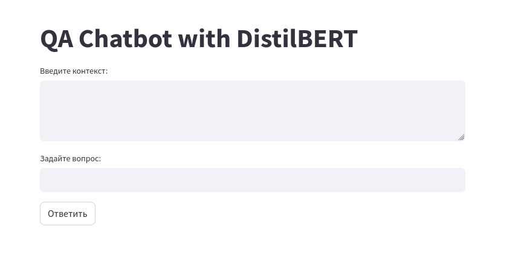

<p align="center">
  
</p>

# How to build

```
git clone https://github.com/AAEfimov/MLOps_compose
cd MLOps_compose
make build
make up

```

# How to test

in the browser 
```
http://localhost:8501/

```

# You can see




# First  Dockerfile version (before push to docker hub)

```
FROM python:3.8.10

# Expose port you want your app on
EXPOSE 8501

# install requirements
COPY requirements.txt ./requirements.txt
RUN pip3 install -r requirements.txt

WORKDIR /server
COPY . .

# Run
CMD streamlit run chat_streamlit.py

```
